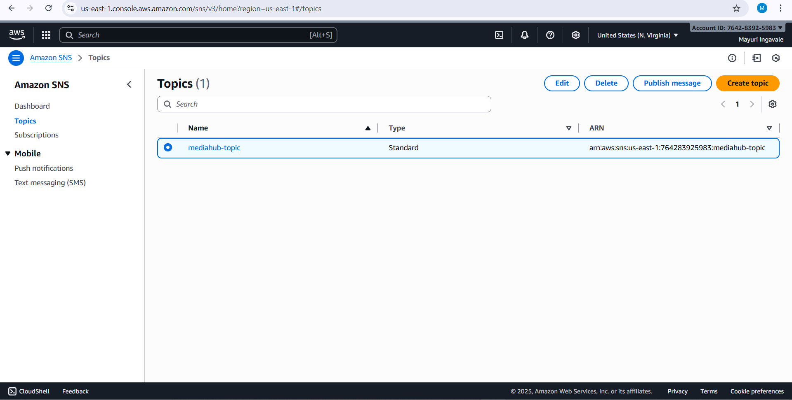
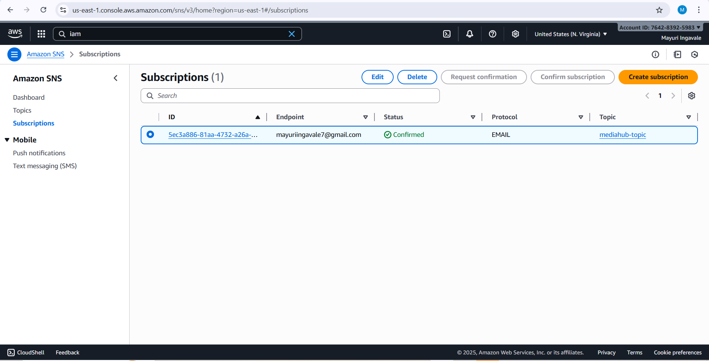
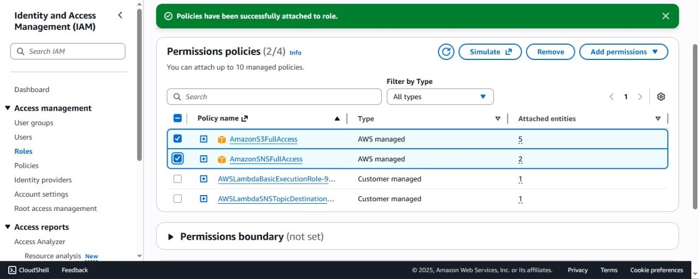
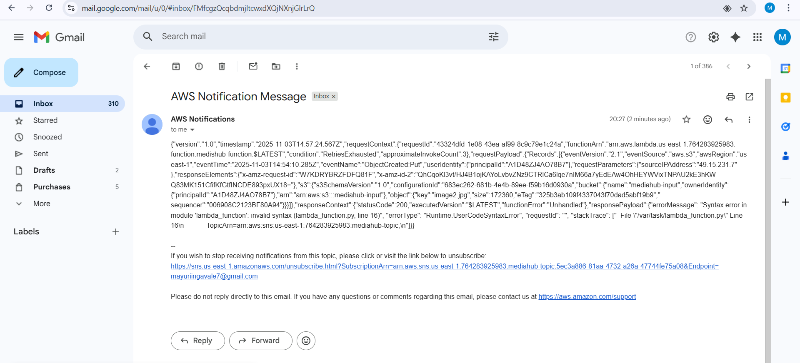

# AWS Lambda + SNS + S3 Email Notification

This project demonstrates how to automatically send an email notification when a file is uploaded to an **Amazon S3 bucket**, using **AWS Lambda** and **Amazon SNS**.

---

##  Architecture Overview

**Flow:**
1. A file is uploaded to the S3 bucket.
2. The S3 event triggers the Lambda function.
3. The Lambda function publishes a message to the **SNS topic**.
4. The **SNS topic** sends an email notification to the subscribed email address.

---
## Steps to Set Up:
### Step1: Create an SNS Topic

---
### Step2: Subscribe an email to the Topic

---
## Step3: Create the Lambda function
- Add an S3 Trigger
- Add an SNS Destination

---
## Step4: Add Permission for SNS and S3

---
## Step4: Upload file on S3 bucket

---
## Step5: Check Email

## Services Used

<table border="4" cellspacing="0" cellpadding="8">
  <thead>
    <tr>
      <th>Service</th>
      <th>Description</th>
    </tr>
  </thead>
  <tbody>
    <tr>
      <td><strong>AWS S3</strong></td>
      <td>Triggers the Lambda function when a file is uploaded.</td>
    </tr>
    <tr>
      <td><strong>AWS Lambda</strong></td>
      <td>Executes the Python code that sends a notification via SNS.</td>
    </tr>
    <tr>
      <td><strong>AWS SNS (Simple Notification Service)</strong></td>
      <td>Sends email notifications to subscribed users.</td>
    </tr>
  </tbody>
</table>

---

## Conclusion:

This project shows how AWS S3, Lambda, and SNS work together to automatically send an email when a file is uploaded. It’s an easy example of serverless automation in AWS.
